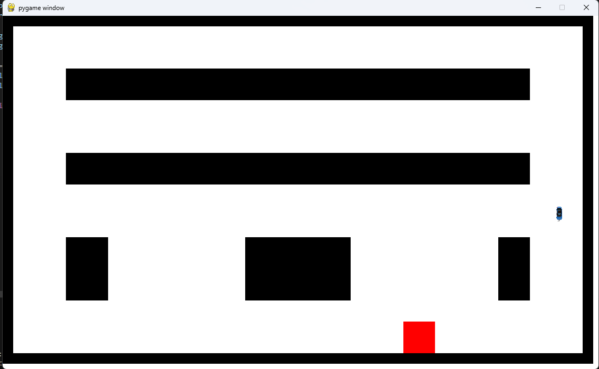

# bayesian-car
Autonomous bayesian car

Proyecto final de la clase Búsqueda de Soluciones e Inferencia Bayesiana.

Autor: Jahzeel Ulises Méndez Díaz

Profesor: Jorge Hermosillo Valadez

Los archivos que inician con testing son aquello que contienen una simulación para probar alguna de las redes bayesianas, para mas información leer el reporte.

Aquellos archivos que inician con collect_* son para la recolección de datos necesarios en el entrenamiento.
